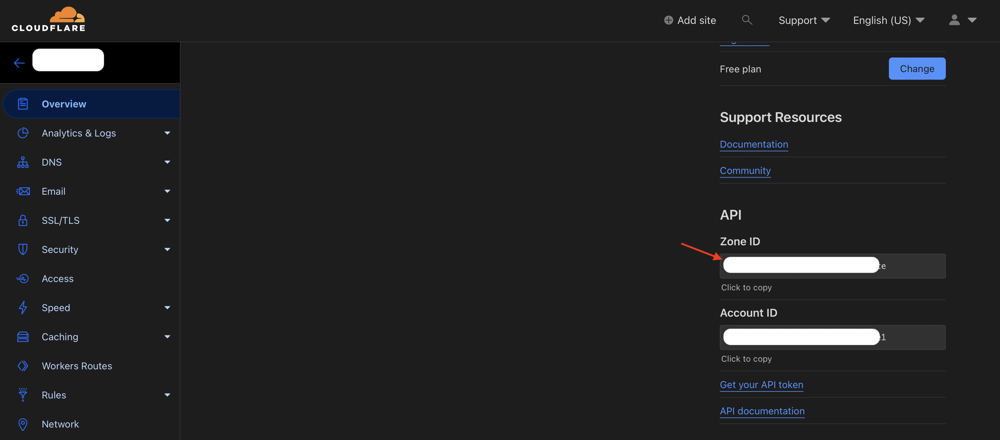
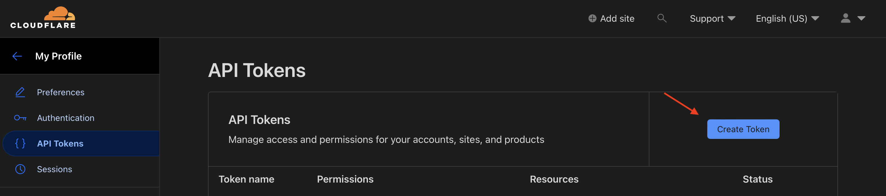

# Setting up dynamic DNS

## Prerequisites

- Cloudflare account
- Domain name

## Flow
- เนื่องจาก Public IP เปลื่ยนตลอด dynamic DNS คือตัวช่วยที่จะเปลี่ยน IP ที่ map กับ domain ไปเรื่อยๆเมื่อ public IP ของเราเปลี่ยน
- Cloudflare ไม่ได้ provide DDNS server จึงต้องเขียนตัวเช็ค หาก public IP เราเปลี่ยน ให้ไป update entry บน cloudflare DNS

## Instructions

- #### get the zone ID


- #### get token

  then use `Edit zone DNS` template and choose your domain

- #### just use this shell script
```
#!/bin/bash

# Set Cloudflare API
ZONE_ID="YOUR_ZONE_ID"
TOKEN="YOUR_TOKEN"
NAME="YOUR_DOMAIN"
URL="https://api.cloudflare.com/client/v4/zones/${ZONE_ID}/dns_records/"

# Check for current external IP
IP=$(dig +short txt ch whoami.cloudflare @1.0.0.1| tr -d '"')

# Connect to Cloudflare
cf() {
curl -s -X ${1} "${URL}${ENTRY_ID}" \
     -H "Content-Type: application/json" \
     -H "Authorization: Bearer ${TOKEN}" \
      ${2} ${3}
}

# Get current DNS data
RESULT_ALL=$(cf GET)
# Get entry ID
ENTRY_ID=$(jq -r '.result[0].id' <<< ${RESULT_ALL})
#echo ${URL}${ENTRY_ID}
RESULT=$(cf GET)
IP_CF=$(jq -r '.result.content' <<< ${RESULT})

TIME=$(date "+%Y-%m-%d %H:%M:%S")
# Compare IPs
if [ "$IP" = "$IP_CF" ]; then
    echo "${TIME} : [${IP}] No change"
else
    RESULT=$(cf PUT --data "{\"type\":\"A\",\"name\":\"${NAME}\",\"content\":\"${IP}\",\"proxied\":true}")
    echo "${TIME} : [${IP}] DNS updated"
fi
```

- #### set crontab to update DNS entries dynamically
```
$ crontab -e

*/15 * * * *    /path/to/your/program >> /var/log/ddns
```