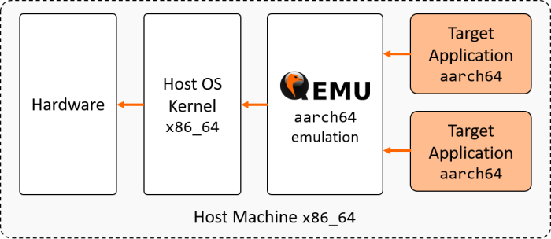

---
tags:
    - Docker
    - Architecture
    - Docker build
---
# Build docker image for other architectures

## Concept



- โดยปกติ docker รัน image ได้เฉพาะ architecture ที่ตรงกับเครื่อง host
- แต่มีวิธีที่ทำให้ docker รัน image ของ architecture อื่นได้ รวมถึง build ได้ด้วย
- นั่นคือการใช้ QEMU ในการจำลอง architecture นั้น แล้วจึงรัน docker

## Instructions

- #### Check the host architecture
```
$ uname -m # Display the host architecture
x86_64
```

- #### Try running aarch64 on x86_64
```
$ docker run --rm -t arm64v8/ubuntu uname -m # Run an executable made for aarch64 on x86_64
standard_init_linux.go:211: exec user process caused "exec format error"
```

- #### Install qemu packages
```
$ dnf install <qemu>
```

- #### Execute registration script
```
$ docker run --rm --privileged multiarch/qemu-user-static --reset -p yes
```

- #### Test on aarch64 image
```
$ docker run --rm -t arm64v8/ubuntu uname -m 
aarch64
```

[reference](https://www.stereolabs.com/docs/docker/building-arm-container-on-x86/)