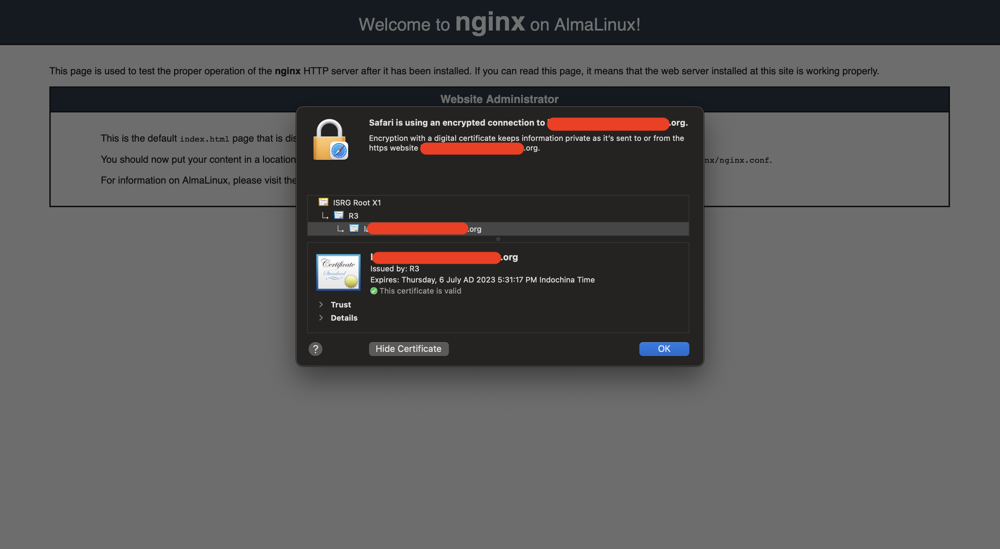

---
tags:
    - Linux
    - SSL
    - Certificate
    - Nginx
---
# Generate SSL certificate for Nginx https

## Instructions

- #### Install certbot and dependencies

```
$ dnf install certbot python3-certbot-nginx
```

- #### Verify hostname and use certbot to generate certificates

```
$ hostname
<server_name>
$ certbot certonly --standalone --preferred-challenges http -d <server_name>
...
Successfully received certificate.
Certificate is saved at: /etc/letsencrypt/live/<server_name>/fullchain.pem
Key is saved at:         /etc/letsencrypt/live/<server_name>/privkey.pem
```

- #### Copy the key and certificates to the nginx pki directory

```
$ cp /etc/letsencrypt/live/<server_name>/{privkey,fullchain}.pem  /etc/pki/nginx/.
```

- #### Edit nginx configuration

```
# /etc/nginx/nginx.conf in the server bolck
server {
        listen       443 ssl http2 default_server;
        listen       [::]:443 ssl http2 default_server;
        server_name  _;
        root         /usr/share/nginx/html;

        ssl_certificate "/etc/pki/nginx/fullchain.pem";
        ssl_certificate_key "/etc/pki/nginx/privkey.pem";
        ssl_session_cache shared:SSL:1m;
        ssl_session_timeout  10m;
        ssl_ciphers PROFILE=SYSTEM;
        ssl_prefer_server_ciphers on;

        # Load configuration files for the default server block.
        include /etc/nginx/default.d/*.conf;

        location / {
        }

        error_page 404 /404.html;
            location = /40x.html {
        }

        error_page 500 502 503 504 /50x.html;
            location = /50x.html {
        }
    }
```

- #### Start nginx

```
$ systemctl start nginx
```

- #### Browse your web server using your web browser

