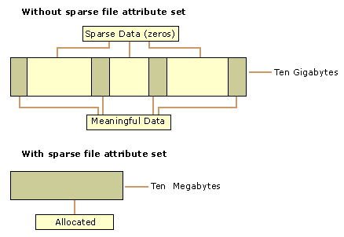

---
tags:
    - Linux
    - Filesystem
    - Note
---
# Sparse file

> a sparse file is a type of computer file that attempts to use file system space more efficiently when the file itself is partially empty.

> This is achieved by writing brief information (metadata) representing the empty blocks to disk instead of the actual "empty" space which makes up the block, using less disk space. The full block size is written to disk as the actual size only when the block contains "real" (non-empty) data.



## `du` vs `ls` command

Sparse files have different apparent file sizes (the maximum size to which they may expand) and actual file sizes (how much space is allocated for data on disk). To check a file's apparent size, just run:

```
$ du -h --apparent-size file.img  # or ls -lh
512M    file.img
```

and, to check the actual size of a file on disk
```
$ du -h file.img
0       file.img
```
referece: [sparse file](https://www.file-recovery.com/recovery-NTFS-sparse-files.htm)