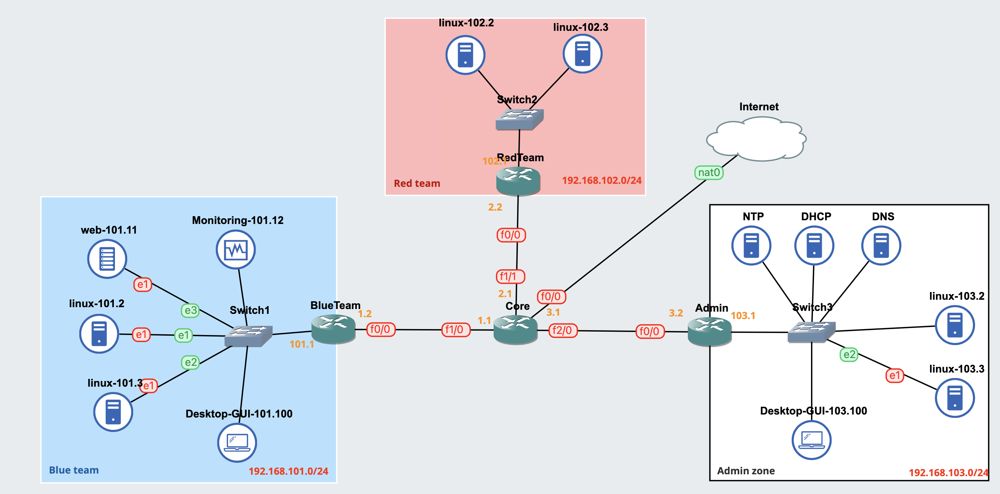

---
tags:
    - Networking
---
# Setup Cisco OSPF routing

> OSPF is a routing protocol, used to distribute IP routing information throughout a single Autonomous System (AS) in an IP network.

## Topology



## Instructions
we have to configure on all of the 3 routers

after we configured IP addresses of the routers

#### The core router 

```
Core(config)#router ospf 1

Core(config-router)#network 192.168.1.0 0.0.0.255 area 0
Core(config-router)#network 192.168.2.0 0.0.0.255 area 0
Core(config-router)#network 192.168.3.0 0.0.0.255 area 0
``` 

#### The BlueTeam router

```
BlueTeam(config)#router ospf 1
BlueTeam(config-router)#network 192.168.101.0 0.0.0.255 area 0   
BlueTeam(config-router)#network 192.168.1.0 0.0.0.255 area 0
```

#### The RedTeam router

```
RedTeam(config)#router ospf 1
RedTeam(config-router)#network 192.168.102.0 0.0.0.255 area 0
RedTeam(config-router)#network 192.168.2.0 0.0.0.255 area 0
```

#### The Admin router
```
Admin(config)#router ospf 1
Admin(config-router)#network 192.168.103.0 0.0.0.255 area 0
Admin(config-router)#network 192.168.3.0 0.0.0.255 area 0
```

#### verify 
```
Core#show ip route
Codes: C - connected, S - static, R - RIP, M - mobile, B - BGP
       D - EIGRP, EX - EIGRP external, O - OSPF, IA - OSPF inter area 
       N1 - OSPF NSSA external type 1, N2 - OSPF NSSA external type 2
       E1 - OSPF external type 1, E2 - OSPF external type 2
       i - IS-IS, su - IS-IS summary, L1 - IS-IS level-1, L2 - IS-IS level-2
       ia - IS-IS inter area, * - candidate default, U - per-user static route
       o - ODR, P - periodic downloaded static route

Gateway of last resort is not set

O    192.168.102.0/24 [110/2] via 192.168.2.2, 00:40:07, FastEthernet1/1
C    192.168.1.0/24 is directly connected, FastEthernet1/0
O    192.168.103.0/24 [110/2] via 192.168.3.2, 00:35:08, FastEthernet2/0
C    192.168.2.0/24 is directly connected, FastEthernet1/1
C    192.168.3.0/24 is directly connected, FastEthernet2/0
O    192.168.101.0/24 [110/2] via 192.168.1.2, 00:38:17, FastEthernet1/0
```

## Conclusion

To use OSPF as a routing protocol, you only specify on routers what subnet they have, then they will propagate the subnet that we specified by themself.

Easy, isn't it? 
