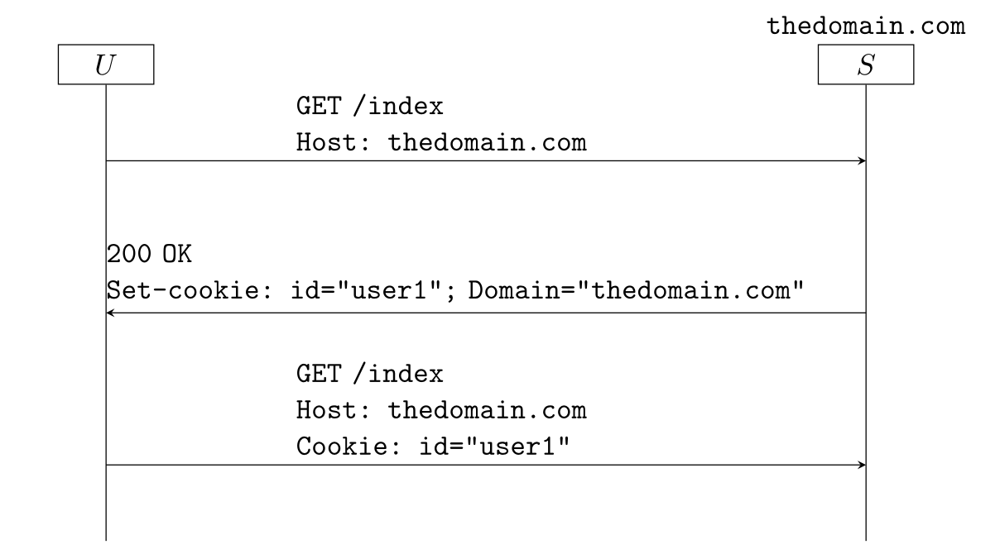

---
tags:
  - Cookies
  - Note
  - Webapp
---
# Browser Cookie Domains
**Cookie domains** specify the domains to which a cookie should be sent by the browser in subsequent requests.

## Why cookies?
HTTP cookies are a small piece of data sent from a website and stored on a user's device to remember information about the user or track their activities on the website. Since HTTP servers are stateless, cookies are used to help servers remember previous interactions with clients.


## Format of cookies

All parts of a cookie are optional except for the name and value. Here's an example of a cookie with several optional attributes:

```
Set-cookie: id = "user1"; Expires = Mon, 16 Jan 2023 22:00:00 GMT; Max-age=3600;
Domain="thedomain.com"; Path="/example"; Secure; HttpOnly
```

- `Expires`: a date after which the user agent (browser) discards the cookie
- `Max-age`: the maximum number of seconds during which the user agent should keep the cookie
- `Domain`: a domain name that the browser uses to determine whether it should send the cookie in a request
- `Path`: a domain name path that the browser uses to determine whether it should send the cookie in a request
- `Secure`: browser sends cookie only if connection is secure, e.g., a secure socket connection using the Transport Layer Security (TLS) protocol
- `HttpOnly`: browser should access cookie only if it wants to send an HTTP message only, i.e., it should not access it by Javascript code in a downloaded page

## Rules for the Exchange of Cookies
Cookie attributes determine whether or not a cookie should be sent in subsequent requests. The Domain and Path attributes are the most important.

Here's an example of cookie exchange flows:



The cookie is sent as header in the request only if:

- The value of the `Host` attribute matches the stored `Domain`, including any wild cards
- The path of the request is the same as or a sub-path of the stored `Path`

reference: [Browser Cookie Domains](https://www.baeldung.com/cs/browser-cookie-domains)